# __CI_PP1_HB__


Code institute Project portfolio 1 Healthy Body **CI_PP1_HB** Is a web page developed to emulate a vegetarian restaurant and create awareness to how we can help the environment with reducing the animal agriculture just eating less meat or not, the second idea is to share how we can be healthy just doing a balanced diet eating more vegges 

   

- HTML 
"HTML is the standard markup language for documents designed to be displayed in a web browser. It can be assisted by technologies such as Cascading Style Sheets (CSS) and scripting languages such as JavaScript. [1](https://en.wikipedia.org/wiki/HTML) "

- CSS
"Cascading Style Sheets (CSS) is a style sheet language used for describing the presentation of a document written in a markup language such as HTML.
[1] CSS is a cornerstone technology of the World Wide Web, alongside HTML and JavaScript.[2](https://en.wikipedia.org/wiki/CSS)"

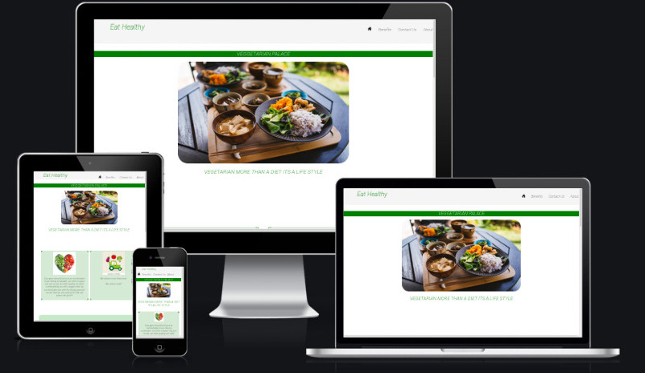 

[Live web page](https://jdhernandezs1.github.io/CI_PP1_HB/index.html)


## Table of Content

1. [Project Goals](#project-goals)
    1. [User Goals](#user-goals)
    2. [Site Owner Goals](#site-owner-goals)
2. [User Experience](#user-experience)
    1. [Target Audience](#target-audience)
    2. [User Requirements and Expectations](#user-requrements-and-expectations)
    3. [User Stories](#user-stories)
3. [Design](#design)
    1. [Design Choices](#design-choices)
    2. [Colour](#colours)
    3. [Fonts](#fonts)
    4. [Structure](#structure)
4. [Technologies Used](#technologies-used)
    1. [Languages](#languages)
    2. [Frameworks & Tools](#frameworks-&-tools)
5. [Features](#features)
6. [Testing](#validation)
    1. [HTML Validation](#HTML-validation)
    2. [CSS Validation](#CSS-validation)
    3. [Accessibility](#accessibility)
    4. [Performance](#performance)
    5. [Device testing](#performing-tests-on-various-devices)
    6. [Browser compatibility](#browser-compatability)
    7. [Testing user stories](#testing-user-stories)
8. [Bugs](#Bugs)
9. [Deployment](#deployment)
10. [Credits](#credits)
11. [Acknowledgements](#acknowledgements)

## Project Goals

### __User Goals__

- Finding a special restaurant that offers a vegetarian menu.
- Find a menu clear and listed with prices.
- Find the location and phone of the restaurant.
- Find a menu with a clear images that shows the meals.
- Find some information for the people that want to start a vegetarian diet.
### __Site Owner Goals__

- Improve the business and acquire clients.
- Provide the information to contact, arrive and explore the restaurant.
- Provide the information for the newbies according to the lifestyle.
- Increase the sales by a clear menu and clear market.

## User Experience

### __Target Audience__

- People looking for a different place to have a taste vegetarian diet.
- Groups of family, friends looking for an eco-friendly place.
- Groups of people who are different and have special diet.
- Groups of people following a healthy and fit life.

### __User Requrements and Expectations__

- A Eco-friendly restaurant who care to the environment.
- A clear and easy navigation page.
- Clear information providing location and contact.
- Social links and media work as well.
- A responsive design that works in different screens.
- Easy information let the user know all the menu and meals available.
- Easy Information by the people that don't have a lot of knowledge of a vegetarian diet.

### User Stories

#### __First-time User__
First time user:

1. wants to know more about the vegetarian diet.
2. wants to know the prices, ingredients and meals variety.
3. wants to know where the restaurant is located and what the contact is for delivery and reservations.
4. wants to let feedback for improving the place that they look for.
5. wants to know more information about the vegetarian diet.

#### __Returning User__
As a returning user, We want:

6. Find a vegetarian place.
7. Find a place who give information about the food that they provide.
8. See a menu and prices.
9. leave feedback about how they felt and what the place can improve.
10. Find the social media of the restaurant. 
11. Know about the bases of the vegetarian diet.
12. Know the location of the restaurant.
13. See the meals offered.
14. Know the benefits of the Diet.

#### __Site Owner__
As the site owner, we want:

15. Clients who are searching change to a new diet and be healthy.
16. Clear page where the client can buy easy.
17. Easy way to contact us and arrive to the restaurant.
18. Make feel the clients a place who care about them.

## Design

### __Design Choices__
The virtual store was designed to make the customer feel that the place is more than a business, where they feel cared for both their health and the environment, leting know the benefits of the diet.

### __Colors__

the color tones were specially chosen to conform to the concept and to a simple and friendly design.
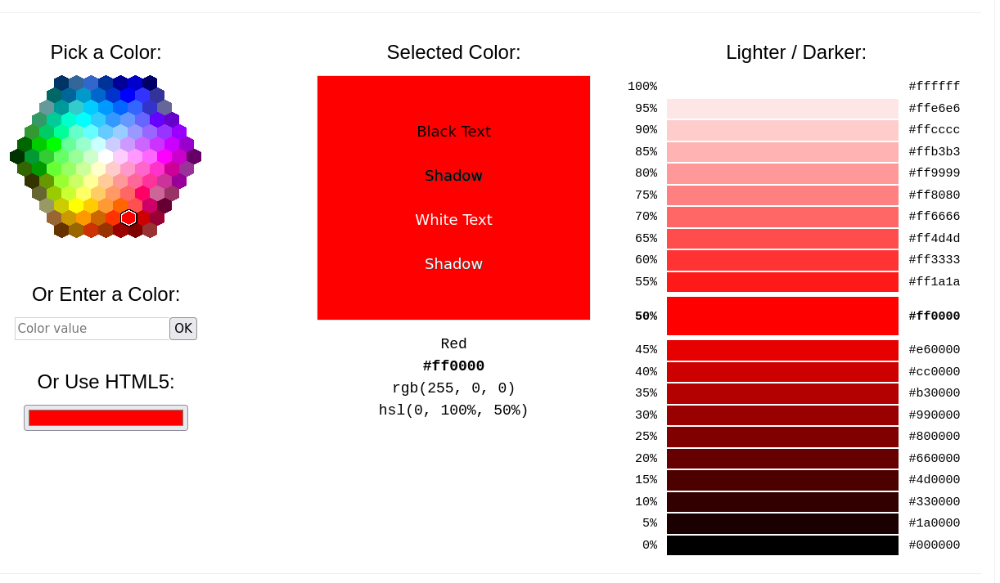  
<br>

### __Fonts__

Was wanted one friendly font and was finding ROBOTO from GOOGLE is a font that has been used in the smartphones.
How the most data traffic is from phones and smart devices was used, a typical font used in those platforms. 
<br>

### __Structure__

Following the theory for UXD (User experience design) the page was structured in a fluent and easy to read, using a structure familiar doing research in the most popular restaurants to know what type of design is using in the modern food pages.
Was used following colors related with the thematic (vegetarian Diet)
The WebPage was divided in 4 pages:
- The home page where is located a little introduction information, some star meals and the service we offer like delivery included.
- A page to describe the benefits of do a vegetarian diet in where the people can know how they help the environment and they self (them healthy).
- A page to show the main information of the restaurant to be contacted like location phone and a little form to acquire some info about the experience.
- The Last one is the menu easy and friendly with the people that don't use a lot the technical devices with a simple design with description name and price.

## Technologies Used

### __Languages__
- HTML5
- CSS

### __Frameworks , Libraries & Tools__
- Visual Studio Code
- Git
- GitHub
- Gitpod
- Balsamiq
- Google Fonts
- W3schools Colors
- Favicon.io
- ion icons

## __Features__

### __Navigation Bar__

The page is divided in 3 HTML documents first is a home page in where the user can apreciate a image to make you feel how taste is it 
the Navigation bar was developed in 2 divisions where contain the items to navigate under the page  

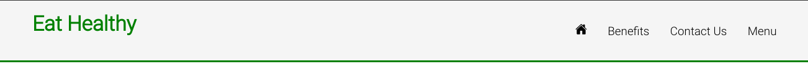  
### __Benefits design__

continue with a slogan for the "restaurant" and a some words to make feel good the guess and some specialitys to open the mind of the readers
and some arguments and bases of the diet second is a little introduction to vegetarian and benefits

  

### __Form Design__
the next section reports about how the meat production destroy the environment and some illneses
third is the contact with us to know about the client and how they felt.
in a relaxing design to dont disturb the writer in where the user can feel quiet to express the ideas.  


### __Footer__

the footer was created to be fluid with the other colors and share some social medias about by the restaurant.
the proyect was developed in HTML & CSS using visual studio code, the code was tested with W3C
every single html file is divided in sections where you have wrappers to be organized and easy future changes.  
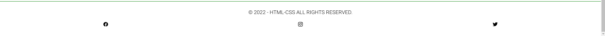  

### __Responsive Design__

Was modified and adapted to the Iphone 5 screen  
you can apreciate how looks in the picture  

 
### __Menu__

Simply and easy use page with the most important indicators like description buttom to buy title and a picture where the clients can know what they will eat

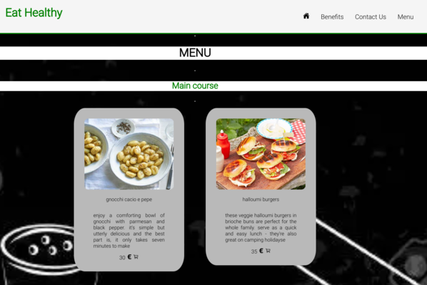 
### __Video__

The video used for the curious clients who want to know more about the diet 

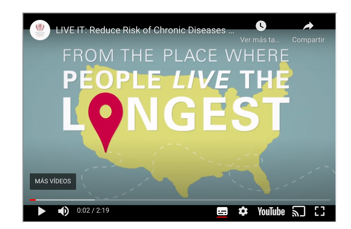  
### __Map and location__

The google map location and phone to contact us.

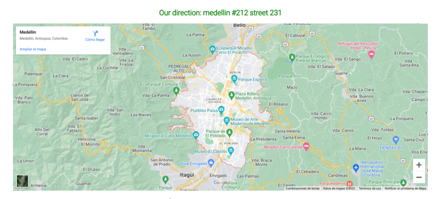 
## Validation

### __HTML Validation__

The Validator used was W3C Service to validate the HTML of the webpage, 
the entire project pass with no errors and warning by use of some tools.

<details><summary>Home Validation</summary>
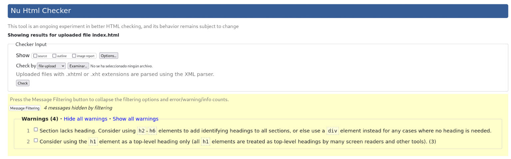
</details>
<details><summary>Benefits Validation</summary>
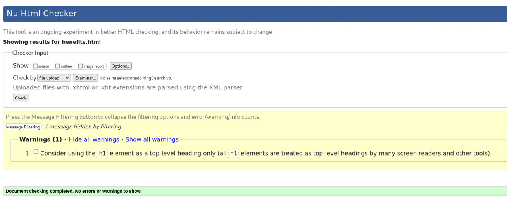
</details>
<details><summary>Contact Us Validation</summary>
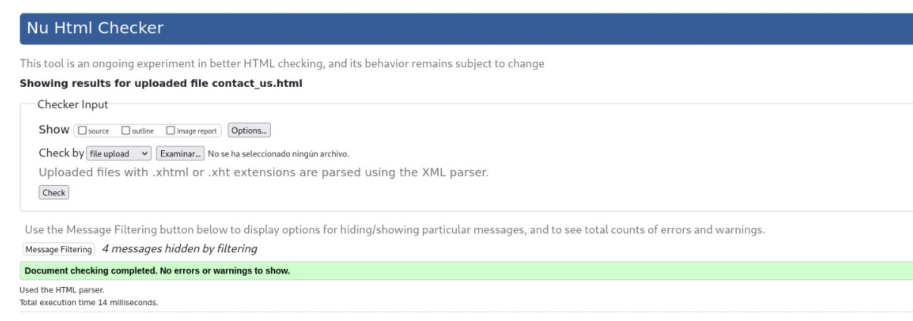
</details>
<details><summary>Menu Validation</summary>
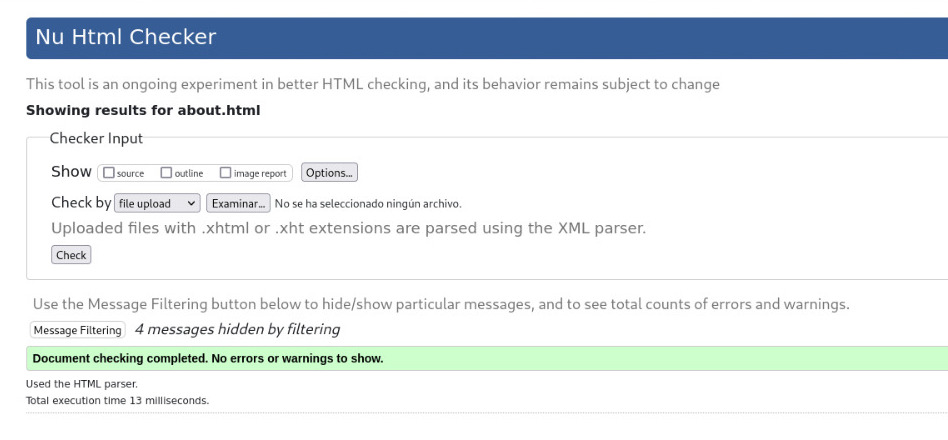
</details>

### __CSS Validation__

W3C's primary activity is to develop protocols and guidelines that guarantee long-term growth for the Web.
W3C's  determine key parts of what makes the World Wide Web activity.
W3C was used to validate the CSS style of the whole page

<details><summary>style.css</summary>
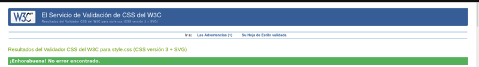
</details>

### __Accessibility__

The WAVE WebAIM web accessibility evaluation tool was used to ensure the website met high accessibility standards. All pages pass with 0 errors.

<details><summary>Home accessibility</summary>
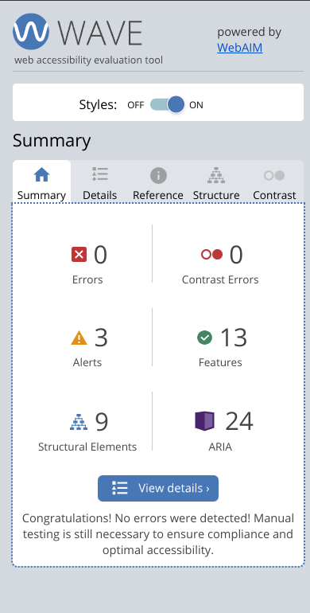
</details>
<details><summary>Benefits accessibility</summary>
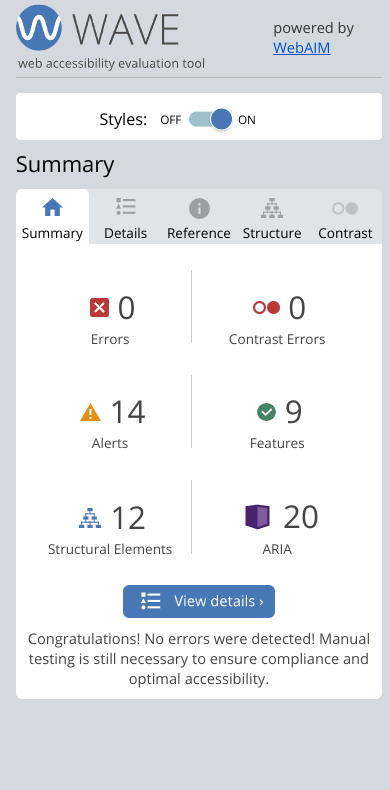
</details>
<details><summary>Contact Us accessibility</summary>
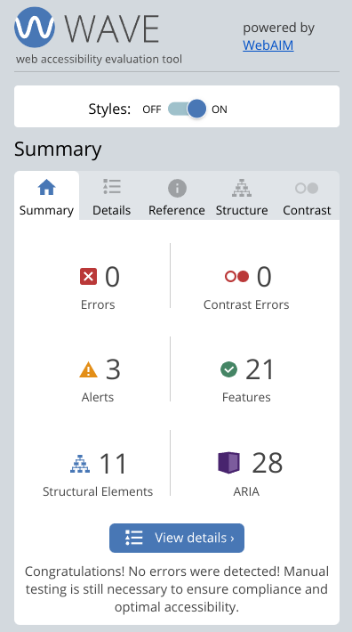
</details>
<details><summary>Menu accessibility</summary>
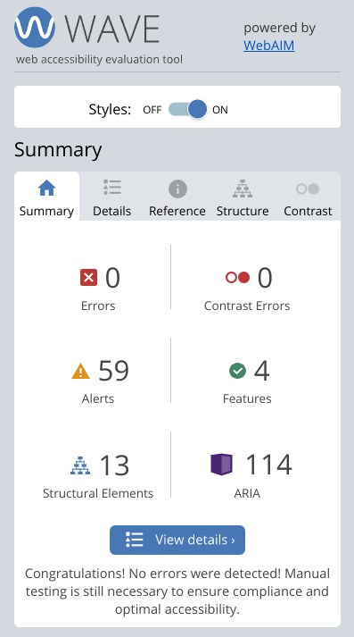
</details>

### __Performance__

 The performance test of the website was make by Google Lighthouse in Google Chrome Developer Tools: 

<details><summary>Home performance</summary>
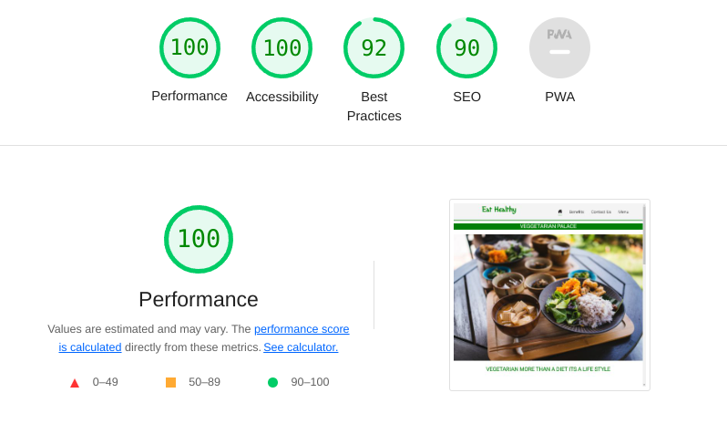
</details>
<details><summary>Benefits performance</summary>
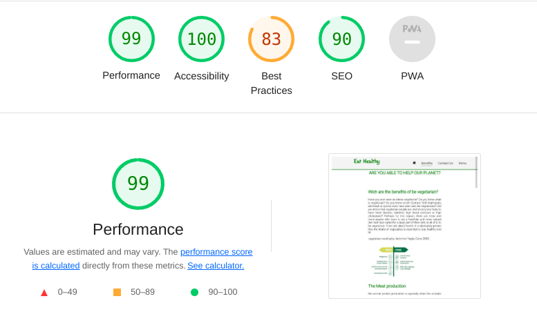
</details>
<details><summary>Contact Us performance</summary>
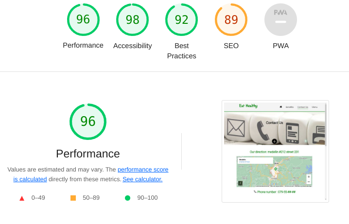
</details>
<details><summary>Menu performance</summary>
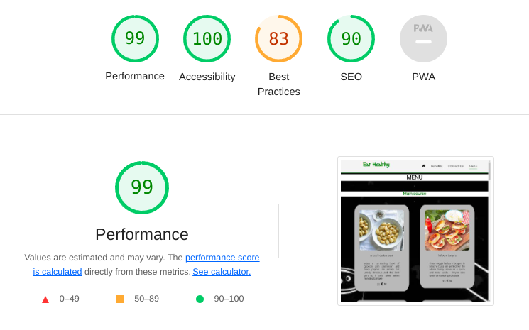
</details>

### Browsers support

| [](http://godban.github.io/browsers-support-badges/)<br/>IE / Edge | [](http://godban.github.io/browsers-support-badges/)<br/>Firefox | [](http://godban.github.io/browsers-support-badges/)<br/>Chrome | [](http://godban.github.io/browsers-support-badges/)<br/>Safari | [](http://godban.github.io/browsers-support-badges/)<br/>Opera |
| --------- | --------- | --------- | --------- | --------- |
| IE11, Edge| last 2 versions| last 2 versions| last 2 versions| last 2 versions

### Testing user stories

1. wants to know more about the vegetarian diet.

| **Feature** | **Action** | **Expected Result** | **Actual Result** |
|-------------|------------|---------------------|-------------------|
| Benefits Information | Navigate to benefits page, locate the Information | Text with the information that they are interesting | Works as well |
| Video shared to complete the information | Go to the end to find it | Find a video where the client can learn more about the diet | Works as well |

2. wants to know the prices, ingredients and meals variety.
3. wants to know where the restaurant is located and what the contact is for delivery and reservations.
4. wants to let feedback for improving the place that they look for.
5. wants to know more information about the vegetarian diet.


<details><summary>Screenshots</summary>


</details>

<!-- im here -->
## __INSTALATION__
You can download the full code with
```bash
git clone https://github.com/jdhernandezS1/CI_PP1_HB.git
```   
and viwed online in [link_to_page](https://jdhernandezs1.github.io/CI_PP1_HB/index.html)


## Objetives
- Help the people to be healthy 
- introduce to a new diet or a new life style
- show the options available 
- show statics and studies to support our ideas
- make feel good the readers during the visit 

## __Built With__

The softwares language and recomended IDE used to build the project.

* [HTML](https://www.w3schools.com/html/)
* [CSS](https://www.w3schools.com/css/default.asp)	
* [visual studio code](https://visualstudio.microsoft.com/es/)
* [Git](https://git-scm.com/)
* [GitHub](https://github.com/)


## __UXD__
Using the user experience design(UX or UE).
UXD is how a user interacts with and experiences a product, system or service.
It includes a person's perceptions of utility, ease of use, and efficiency. 
This design improve user experience of the most important companies, designers, and creators when creating and refining products because negative user experience can diminish the use of the product and, therefore, any desired positive impacts; conversely, designing toward profitability often conflicts with ethical user experience objectives and even causes harm. User experience is subjective. However, the attributes that make up the user experience are objective. 


## __Dark Mode (Only light Mode)__

You can use light-mode-only version, if you are not using light mode and also file size less without dark-mode.

## __TESTING__

### JIGSAW
No errors were returned of CSS file when passing through the official W3C validator Jigsaw validator
Deployment
was design in html and css using the concepts and applying to the entire design.
was tested with wc3 compilator environment were used some pictures and some information with the references to let know the user are not our images
<details><summary>Index</summary>

</details>
<details><summary>About</summary>

</details>
<details><summary>Benefits</summary>

</details>
<details><summary>Contact us</summary>

</details>
<details><summary>Style</summary>

</details>

## __Contributing__

Please read through our contributing guidelines, every pull request has been notified to be able to push code included 
- directions for opening issues
- coding standards
- notes on development
## __License__

- CI_PP1_HB is an open source project by [CI_PP1_HB](https://github.com/jdhernandezS1/CI_PP1_HB) that is licensed under [ops](https://opensource.org/).
- CI_PP1_HB reserves the right to change the license of future releases.

## __Credits__

-Google apis for fonts and maps : fonts.googleapis.com
- icons source : https://ionic.io/ionicons
- https://www.w3schools.com  
## __BUGS FIXED__

- Superposition: z-index for the nav bar because the ion icons and navigation bar had different z level
was solved with change priority
