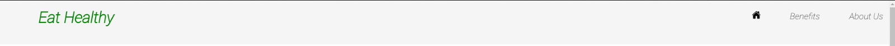
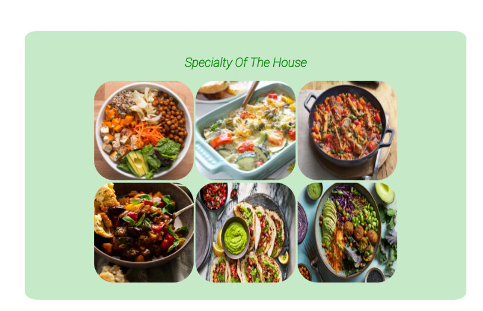
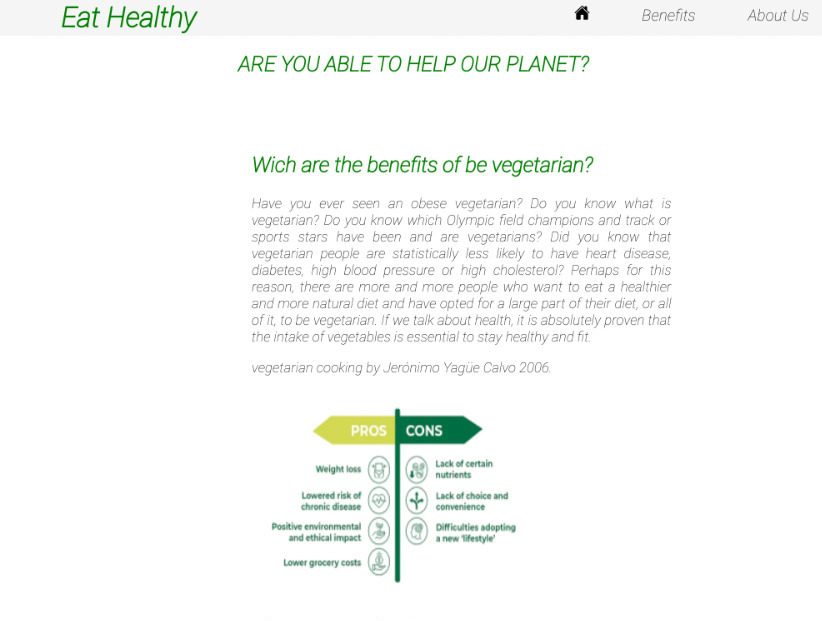
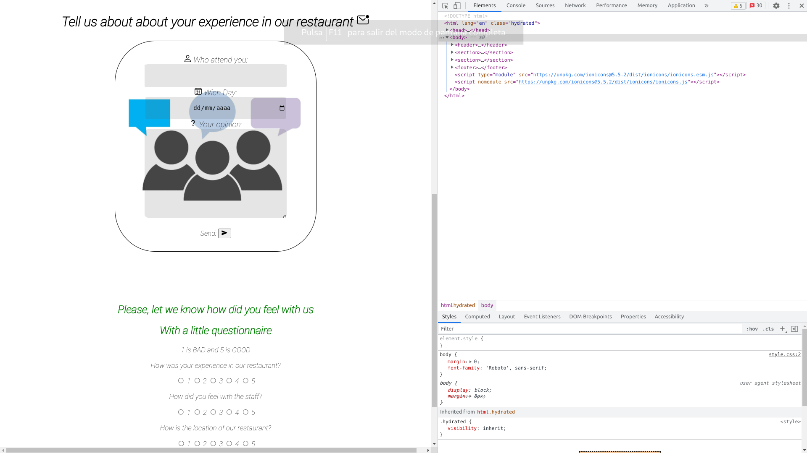
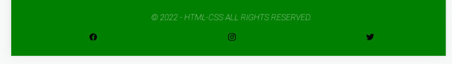
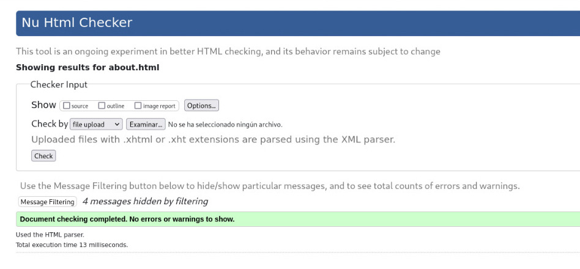
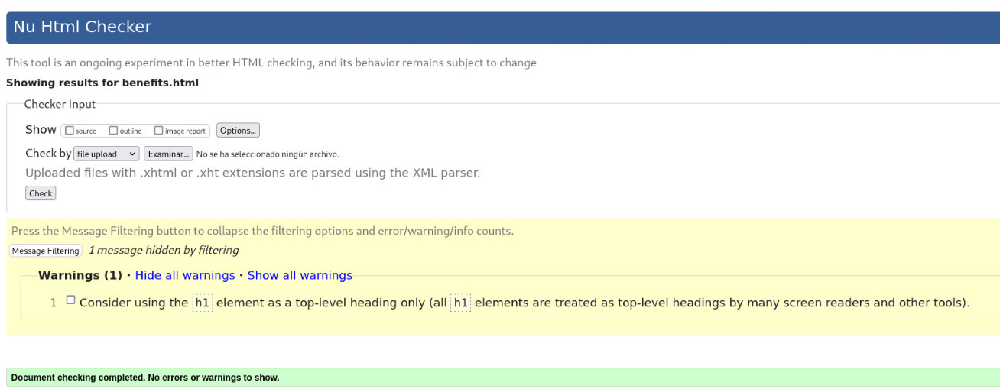
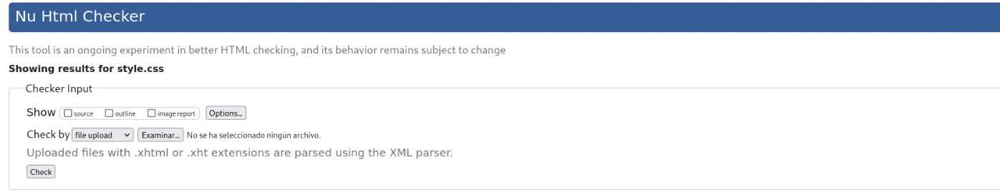

# __PP1_PROJECT__

This web page was developed to emulate a veggetarian restaurant and create awareness to how we can help the environment with reducing the animal agriculture just eating less meat or any, the second is how we can be healty just doing a balanced diet eating more veggs
# __INSTALATION__
.  
the code can be downloaded 
with comand git clone https://github.com/jdhernandezS1/PP1_PROJECT.git  
and viwed online in [link_to_page](https://jdhernandezs1.github.io/PP1_PROJECT/index.html)

# __Features__
.  
The page is divided in 3 HTML documents first is a home page in where the user can apreciate a image to make you feel how taste is it 
the Navigation bar was developed in 2 divisions where contain the items to navigate under the page  
  

continue with a slogan for the "restaurant" and a some words to make feel good the guess and some specialitys to open the mind of the readers

	

and some arguments and bases of the diet
second is a little introduction to vegetarian and benefits
  
the next section reports about how the meat production destroy the environment and some illneses
third is the contact with us to know about the client and how they felt.
in a relaxing design to dont disturb the writer in where the user can feel quiet to express the ideas.  

the footer was created to be fluid with the other colors and share some social medias about by the restaurant.
the proyect was developed in HTML & CSS using visual studio code, the code was tested with W3C
every single html file is divided in sections where you have wrappers to be organized and easy future changes.  
  
# __TESTING__
.  
No errors were returned when passing through the official W3C validator and advertences for use of name CSS no errors were found when passing through the official (Jigsaw) validator
Deployment
was design in html and css using the concepts and applying to the entire design.
was tested with wc3 compilator environment were used some pictures and some information with the references to let know the user are not our images

  
# __Credits__
.  
	Google apis for fonts and maps : fonts.googleapis.com
	icons source : https://ionic.io/ionicons
	https://www.w3schools.com  
# __BUGS FIXED__
.  
	z-index for the nav bar because the ion icons and navigation bar had different z level
	was solved with change priority
